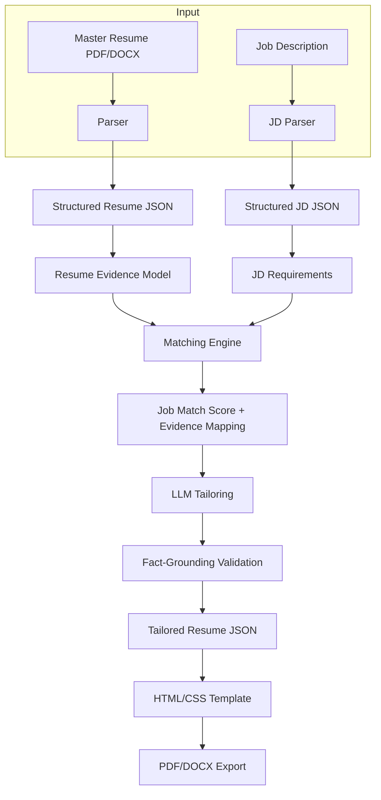

# **ATS Doctor – Product Requirements Document (PRD)**
**Version:** 1.2
**Date:** 2026-08-12
**Status:** MVP Specification (v1.2 — final technology stack applied: Java 21 / Spring Boot modular monolith; see Change Log)
**Author:** Mistral Vibe
**Reviewers:** Expert review incorporated (2026-08-12); architecture finalized 2026-08-12
**Type:** Local-first, AI-provider-agnostic, Single-User Resume Optimization System

**Document Legend** — scope classification used throughout:
| Tag | Meaning | Sections |
|-----|---------|----------|
| **PR** | Product requirements (what the product must do) | §1, §2, §5, §11 |
| **ARC** | Architecture (how components are structured) | §3, §6, §7, §8 |
| **IMP** | Implementation details (specific decisions/technologies) | §4, §9, §12 |
| **FUT** | Future enhancements (explicitly out of current scope) | §2.2, §10 (Sprint 8+), §15 |

---

---

---

## **📌 Executive Summary**
**ATS Doctor** is a **local-first**, single-user application that optimizes a user’s **master resume** for specific job descriptions (JDs) by:
1. **Parsing** and structuring the resume into actionable evidence.
2. **Analyzing** JDs to extract skills, requirements, and keywords.
3. **Matching** JD requirements against resume evidence (exact + semantic).
4. **Tailoring** the resume for ATS compatibility **without fabricating experience**.
5. **Validating** outputs to prevent hallucinations.
6. **Exporting** tailored resumes as PDF/DOCX.

**Key Differentiators:**
✅ **Local-first** – Application data, files, resumes, jobs, analyses, and outputs stay on the local machine by default. AI inference may run locally or via an explicitly configured external provider.
✅ **AI-Provider Agnostic** – An internal **AI Abstraction Layer** sits above OmniRoute; no application/domain code depends on DeepSeek, Gemini, Claude, OpenAI, or any specific model.
✅ **OmniRoute Gateway** – Provider/model switching (local/remote) happens via deployment configuration only.
✅ **Evidence-Based** – Every claim traces back to the master resume.
✅ **Fact-Grounded** – Defense-in-depth validation of AI-generated content (no "hallucination-proof" guarantees).
✅ **Deterministic Scoring** – Explainable Job Match scores (no black boxes).
✅ **Source of Truth** – The master resume is immutable; every tailored resume references one master version.

---

---

---

# **🎯 1. Product Overview**

### **1.1 Purpose**
ATS Doctor solves the problem of **resume-JD mismatch** for job applicants by:
- Automatically aligning a user’s experience with job requirements.
- Generating **ATS-optimized resumes** that rank higher in applicant tracking systems.
- Ensuring **no fabricated claims** (a common issue with AI resume tools).

### **1.2 Target Audience**
| **User Type**       | **Description**                          | **Scale**       |
|----------------------|------------------------------------------|-----------------|
| Job Seekers         | Individual users tailoring resumes.      | Single-user     |
| Developers          | Local deployment (no SaaS overhead).     | Local Docker    |
| Recruiters (Future)  | *Out of scope for MVP*                    | N/A             |

### **1.3 Deployment Model**
- **Local Docker Compose** (Next.js + Spring Boot + PostgreSQL + OmniRoute).
- **Local-first**: application data, files, resumes, jobs, analyses, and generated outputs are stored locally by default. AI inference may run locally (Ollama) or through an explicitly configured external provider via OmniRoute.
- **No authentication** (single-user assumption).
- **File storage** on local filesystem (`/data`) via a Docker volume bound to the backend only.
- **AI transparency** in the UI at all times:
  ```text
  AI Provider: DeepSeek V4 Flash
  Data leaves this machine: Yes
  ```
  ```text
  AI Provider: Local Model
  Data leaves this machine: No
  ```

### **1.4 Core Value Proposition**
> *"Turn one master resume into infinitely many ATS-optimized versions—locally, privately, and without fabricating experience."*

---

---

---

# **🚀 2. Goals & Non-Goals**

## **2.1 Primary Goals (MVP)**
| **Goal**                          | **Priority** | **Success Metric**                          |
|------------------------------------|--------------|---------------------------------------------|
| Parse PDF/DOCX resumes into structured JSON | P0 | ≥95% field-level accuracy on internal evaluation set. |
| Extract structured data from JDs   | P0 | Correctly identify skills/requirements.     |
| Match JD requirements to resume evidence | P0 | ≥80% precision in evidence mapping.         |
| Generate tailored resumes          | P0 | No fabricated claims (validated).            |
| Calculate explainable Job Match scores | P0 | Score breakdown by category (skills, keywords, etc.). |
| Export PDF/DOCX                    | P0 | Visually clean, ATS-compatible formats.      |
| Integrate OmniRoute for AI         | P0 | Switch models without backend changes.      |

## **2.2 Secondary Goals (Post-MVP)**
- Cover letter generation.
- Skill-gap analysis.
- Interview question suggestions.
- Multiple master resumes.

## **2.3 Non-Goals (Explicitly Excluded)**
| **Feature**               | **Rationale**                              |
|---------------------------|--------------------------------------------|
| Google OAuth              | Single-user; no auth needed.               |
| Multi-user accounts       | Local-only; no shared infrastructure.      |
| Cloud object storage      | Use local filesystem (`/data`).            |
| Payments/credits system    | No monetization in MVP.                    |
| Chrome extension          | Out of scope (future consideration).       |
| Hosted vector DB          | Use PostgreSQL + in-memory embeddings.      |
| Microservices             | Monolithic Spring Boot backend.                |
| External PDF storage       | Store files locally.                       |
| Production CDN            | Local deployment only.                     |
| Job scraping              | Manual JD input only.                      |

---

---

---

# **🏗️ 3. Architecture Overview**

## **3.1 High-Level Architecture**
ATS Doctor is a **local-first modular monolith**: one Spring Boot backend containing clear domain modules (resume, job, analysis, tailoring). **No application/domain code ever calls a specific AI provider directly** — all AI traffic flows through ATS Doctor's own abstraction layer, then Spring AI, then OmniRoute, then a configured provider.

```text
                     ┌───────────────────────┐
                     │      Next.js UI       │
                     └───────────┬───────────┘
                                 │   REST (/api/v1)
                                 ▼
                     ┌───────────────────────┐
                     │     Spring Boot       │
                     │  Modular Monolith     │
                     │  Domain Modules       │
                     └───────────┬───────────┘
                                 │
             ┌───────────────────┼───────────────────┐
             │                   │                   │
             ▼                   ▼                   ▼
        PostgreSQL             /data             AIService
                                                   (internal)
                                                     │
                                                     ▼
                                                 Task Router
                                                     │
                                                     ▼
                                                  Spring AI
                                                     │
                                                     ▼
                                                  OmniRoute
                                                     │
                               ┌──────────────────────┼─────────────────────┐
                               │                      │                     │
                               ▼                      ▼                     ▼
                           DeepSeek                Gemini                Claude
                               │                      │                     │
                               └──────────────────────┼─────────────────────┘
                                                      │
                                                Local Models
                                               (Ollama)
```

> **ARC**: DeepSeek, Gemini, Claude, OpenAI, and local models are all interchangeable **deployment configurations** behind OmniRoute. None of them appear in ATS Doctor's application code.

## **3.2 Component Breakdown**
| **Component**       | **Technology**               | **Purpose**                                  |
|--------------------|-----------------------------|---------------------------------------------|
| Frontend           | Next.js 14 + TypeScript + Tailwind + shadcn/ui | User interface for resume/JD management.    |
| Backend            | Spring Boot (Java 21)       | REST API, domain logic, AI orchestration — one modular monolith. |
| ORM / Persistence  | Spring Data JPA + Hibernate | Database interactions.                      |
| Database           | PostgreSQL 15 + Flyway      | Store structured resume/JD data; versioned migrations. |
| File Storage       | Local filesystem (`/data`)  | Original/exported PDFs, DOCX, JSON.         |
| **AIService**      | Internal Spring Boot module | ATS Doctor's own AI abstraction layer (§6.1). |
| **Task Router**    | Internal Spring Boot module | Maps AI tasks → model profiles (§6.2).      |
| AI Client          | Spring AI                   | Unified chat-client abstraction **below** ATS Doctor's layer. |
| AI Gateway         | OmniRoute                   | Provider abstraction **below** Spring AI.   |
| Model Runtime      | Ollama (optional)           | Local LLM execution.                        |
| PDF/DOCX Parsing   | Apache PDFBox, Apache POI   | Text extraction from resumes/JDs.           |
| PDF/DOCX Export    | Flying Saucer + OpenPDF, Apache POI | ATS-friendly HTML/CSS → PDF; editable DOCX. |

## **3.3 Docker Compose Structure**
```yaml
services:
  frontend:
    build: ./frontend  # Next.js
    ports: ["3000:3000"]
    depends_on: ["backend"]
    # No filesystem volume: the frontend only talks to the backend API.

  backend:
    build: ./backend   # Spring Boot (Java 21)
    ports: ["8000:8000"]
    depends_on: ["postgres", "omniroute"]
    environment:
      - SPRING_DATASOURCE_URL=jdbc:postgresql://postgres:5432/ats
      - SPRING_AI_OPENAI_BASE_URL=http://omniroute:8080
    volumes: ["./data:/data"]  # Only the backend accesses the local filesystem

  postgres:
    image: postgres:15
    environment:
      - POSTGRES_PASSWORD=postgres
      - POSTGRES_DB=ats
    volumes: ["pgdata:/var/lib/postgresql/data"]

  omniroute:
    image: ghcr.io/omniroute/omniroute:latest
    ports: ["8080:8080"]
    volumes: ["./omniroute/config:/config"]

  ollama:  # Optional
    image: ollama/ollama:latest
    volumes: ["./ollama:/root/.ollama"]

volumes:
  pgdata:
```

**Volume policy**:
- `backend` → `./data:/data` (the only service with filesystem access).
- `postgres` → named `pgdata` volume (no host path mount).
- `frontend` → **no** filesystem access; browser → Next.js → Spring Boot only.

## **3.4 Data Flow**


---

---

---

# **📂 4. File & Data Structure**

## **4.1 Directory Structure**
```bash
/data/
├── resumes/
│   ├── master/
│   │   ├── original.pdf       # Original uploaded resume
│   │   ├── original.docx      # Optional
│   │   └── master.json        # Structured resume (canonical)
│   └── versions/              # Historical versions
│       └── v1_2026-08-12.json
│
├── jobs/
│   └── <job-id>/
│       ├── original.pdf      # Uploaded JD
│       ├── source.txt        # Extracted text
│       └── structured.json   # Parsed JD data
│
├── analyses/
│   └── <analysis-id>/
│       ├── analysis.json     # Match results, scores
│       └── tailored.json     # Generated resume
│
└── outputs/
    └── <analysis-id>/
        ├── resume.pdf        # Final export
        ├── resume.docx       # Optional
        └── resume.html       # Intermediate
```

## **4.2 Resume JSON Schema (`master.json`)**
```json
{
  "metadata": {
    "id": "resume_001",
    "version": 1,
    "source_filename": "master.pdf",
    "parsed_at": "2026-08-12T10:00:00Z",
    "model_used": "local",                // AI model for parsing
    "model_version": "llama3.2:latest",   // exact model revision
    "prompt_version": "resume-parser-v1", // prompt that produced this parse
    "temperature": 0.1,                   // generation config
    "is_source_of_truth": true            // master resume is immutable
  },
  "basics": {
    "name": "Azhar",
    "email": "azhar@example.com",
    "phone": "+1234567890",
    "location": "San Francisco, CA",
    "linkedin": "linkedin.com/in/azhar",
    "github": "github.com/azhar"
  },
  "summary": "Senior Software Engineer with 5+ years...",
  "skills": [
    { "name": "Python", "category": "Language", "years": 5 },
    { "name": "FastAPI", "category": "Framework", "years": 3 },
    { "name": "PostgreSQL", "category": "Database", "years": 4 }
  ],
  "experience": [
    {
      "id": "exp_001",
      "company": "Tech Corp",
      "title": "Senior Backend Engineer",
      "start": "2020-01",
      "end": "present",
      "location": "Remote",
      "description": "Backend team lead...",
      "bullets": [
        {
          "id": "exp_001_bullet_001",
          "text": "Built FastAPI services processing 2M events/day.",
          "technologies": ["FastAPI", "Python", "PostgreSQL"],
          "metrics": ["2M events/day"],
          "domains": ["distributed systems", "backend"],
          "evidence_level": "explicit"  // explicit, inferred
        }
      ]
    }
  ],
  "projects": [
    {
      "id": "proj_001",
      "name": "Distributed Queue System",
      "description": "Scalable task queue...",
      "technologies": ["Python", "Redis"],
      "outcomes": ["Reduced latency by 40%"],
      "bullets": []
    }
  ],
  "education": [
    {
      "institution": "Stanford University",
      "degree": "MSc Computer Science",
      "start": "2018-01",
      "end": "2020-01"
    }
  ],
  "evidence_model": {
    "source_of_truth": "resume_001_v1",
    "claims": [
      {
        "id": "exp_001_bullet_001",
        "type": "bullet",
        "text": "Built FastAPI services processing 2M events/day.",
        "category": "A",  // A=immutable fact, B=supported descriptor, C=unsupported claim
        "source_refs": ["exp_001", "skill_python", "metric_2m"],
        "facts": [
          { "kind": "technology", "value": "FastAPI" },
          { "kind": "metric", "value": "2M events/day" }
        ]
      },
      { "id": "skill_python", "type": "skill", "name": "Python", "category": "A" }
    ]
  }
}
```

## **4.3 JD JSON Schema (`structured.json`)**
```json
{
  "metadata": {
    "id": "job_001",
    "source": "upload",
    "filename": "2026-08-12-google-swe.md",
    "parsed_at": "2026-08-12T11:00:00Z",
    "model_used": "local",
    "model_version": "llama3.2:latest",
    "prompt_version": "jd-parser-v1",
    "temperature": 0.1
  },
  "job": {
    "title": "Senior Backend Engineer",
    "company": "Google",
    "location": "Mountain View, CA",
    "seniority": "Senior",
    "post_date": "2026-08-10",
    "url": "https://..."  // Optional
  },
  "requirements": [
    {
      "id": "req_001",
      "text": "5+ years of backend development experience",
      "type": "experience",
      "importance": "high",  // high, medium, low
      "keywords": ["backend", "5+ years", "experience"]
    },
    {
      "id": "req_002",
      "text": "Experience with Python and FastAPI",
      "type": "skill",
      "importance": "high",
      "keywords": ["Python", "FastAPI"]
    }
  ],
  "skills": {
    "required": ["Python", "FastAPI", "PostgreSQL"],
    "preferred": ["Docker", "AWS", "Kubernetes"],
    "nice_to_have": ["Kafka", "gRPC"]
  },
  "responsibilities": [
    "Design and implement scalable REST APIs",
    "Optimize database performance",
    "Collaborate with frontend teams"
  ],
  "keywords": ["Python", "FastAPI", "PostgreSQL", "REST", "scalable", "distributed"]
}
```

## **4.4 Analysis JSON Schema**
```json
{
  "metadata": {
    "id": "analysis_001",
    "resume_version_id": "resume_001_v1",
    "job_id": "job_001",
    "created_at": "2026-08-12T12:00:00Z",
    "status": "READY",  // QUEUED → MATCHING → SCORING → READY | FAILED
    "generation": {
      "jd_parser": { "profile": "cheap", "model": "deepseek-v4-flash", "model_version": "deepseek-v4-flash", "prompt_version": "jd-parser-v1", "temperature": 0.1 },
      "tailoring": { "profile": "quality", "model": "deepseek-v4-flash", "model_version": "deepseek-v4-flash", "prompt_version": "tailor-bullet-v1", "temperature": 0.2 },
      "validation": { "profile": "quality", "model": "deepseek-v4-flash", "model_version": "deepseek-v4-flash", "prompt_version": "validator-v1", "temperature": 0 }
    }
  },
  "score": {
    "total": 84,
    "breakdown": {
      "skills": { "score": 92, "weight": 0.30 },
      "keywords": { "score": 81, "weight": 0.20 },
      "responsibilities": { "score": 88, "weight": 0.20 },
      "experience": { "score": 86, "weight": 0.15 },
      "seniority": { "score": 75, "weight": 0.10 },
      "education": { "score": 100, "weight": 0.05 }
    }
  },
  "matches": [
    {
      "requirement_id": "req_002",
      "requirement_text": "Experience with Python and FastAPI",
      "evidence": [
        {
          "id": "exp_001_bullet_001",
          "text": "Built FastAPI services processing 2M events/day.",
          "type": "experience_bullet",
          "match_type": "exact",  // exact, semantic, partial
          "score": 0.98,
          "keywords_matched": ["FastAPI", "Python"]
        }
      ],
      "status": "matched"  // matched, partial, unmatched
    }
  ],
  "gaps": [
    {
      "requirement_id": "req_003",
      "requirement_text": "Kubernetes experience",
      "status": "unmatched",
      "suggestions": [
        "Add Kubernetes to skills if applicable.",
        "Highlight any containerization experience."
      ]
    }
  ],
  "tailored_resume": {
    "summary": "Senior Backend Engineer with 5+ years...",
    "experience": [
      {
        "id": "exp_001",
        "bullets": [
          {
            "original_id": "exp_001_bullet_001",
            "original_text": "Built FastAPI services processing 2M events/day.",
            "tailored_text": "Engineered scalable FastAPI backend services processing 2M events/day.",
            "reason": "Better alignment with JD keywords ('scalable', 'backend')."
          }
        ]
      }
    ]
  },
  "validation": {
    "is_valid": true,
    "issues": [],
    "warnings": [
      {
        "type": "metric_inconsistency",
        "text": "Tailored bullet claims '3M events/day' vs original '2M events/day'.",
        "severity": "high",
        "action": "Revert to original or provide evidence."
      }
    ]
  }
}
```

---

---

---

# **🎯 5. Core Features & Requirements**

---

## **5.1 Resume Management**
### **Feature: Master Resume Upload**
| **Requirement**               | **Details**                                                                 | **Priority** |
|-------------------------------|-----------------------------------------------------------------------------|--------------|
| Supported formats             | PDF, DOCX (P0); TXT, Markdown (P1)                                          | P0           |
| File size limit               | ≤10MB per file                                                             | P0           |
| Parsing accuracy              | ≥95% field-level accuracy on internal eval set (fields: name, company, title, dates, bullet count, skills) | P0 |
| Structured output             | JSON with evidence model (see Section 4.2)                                 | P0           |
| Versioning                    | Auto-save versions on upload/replace                                       | P0           |
| Source of truth               | Master resume is immutable; new uploads create a new version              | P0           |
| Manual editing                | Edit structured JSON via UI                                                | P1           |

### **Feature: Resume Evidence Model**
- **Purpose**: Model the resume as a set of **evidence claims** with explicit source references — **not** a graph database.
- **Claims**:
  - Experience bullets (e.g., `exp_001_bullet_001`).
  - Skills (e.g., `Python`, `FastAPI`).
  - Projects (e.g., `proj_001`).
  - Metrics (e.g., `2M events/day`).
- **References**: Each claim lists the source IDs it traces to (`source_refs` in Section 4.2).
- **Claim categories** (drive validation and tailoring):
  - **Category A – Immutable facts**: must come directly from the master resume (technologies, metrics, companies, titles, dates).
  - **Category B – Supported descriptors**: can be inferred/rephrased from evidence (e.g., "backend", "distributed", "automation").
  - **Category C – Unsupported claims**: can never be introduced (e.g., "led team of 10", "increased revenue 40%").
- **Implementation**: Postgres relational tables + JSONB (`resume_evidence`). No graph DB, no graph abstraction.
- **Use Case**: Requirement→evidence matching and truth-ledger tracing.

---

## **5.2 Job Description Processing**
### **Feature: JD Input**
| **Requirement**               | **Details**                                                                 | **Priority** |
|-------------------------------|-----------------------------------------------------------------------------|--------------|
| Paste text                    | Accept raw text input                                                      | P0           |
| Upload file                   | PDF, DOCX, TXT                                                             | P0           |
| URL extraction (Future)       | Scrape JD from LinkedIn/Greenhouse (P2)                                    | P2           |
| Text extraction               | Apache PDFBox (PDF), Apache POI (DOCX)                                    | P0           |
| Chunking                      | Split into sections (requirements, skills, etc.)                          | P0           |

### **Feature: JD Structuring**
- **Output**: Structured JSON (see Section 4.3).
- **AI Task**: Extract:
  - Job title, company, seniority.
  - Required/preferred skills.
  - Responsibilities.
  - Keywords (normalized).
  - Experience requirements (e.g., "5+ years").
- **Fallback**: If AI fails, use regex/rule-based extraction.

---

## **5.3 Matching Engine**
### **Feature: Phased Matching (exact first)**
Matching is **exact-first**; semantic search is a later refinement, not a prerequisite:

```text
JD requirement
       ↓
normalized skill/keyword
       ↓
exact matching (string / fuzzy)
       ↓
candidate evidence
       ↓
semantic matching ONLY for ambiguous cases (Phase 2 / v0.3, optional)
```

**Why**: Deterministic, easy to debug ("why did the score change?"), and requires no embeddings or pgvector for the MVP.

### **Feature: Exact Matching**
| **Type**               | **Implementation**                          | **Example**                          |
|------------------------|--------------------------------------------|--------------------------------------|
| Skill matching         | String comparison (case-insensitive)      | JD: `Python` ↔ Resume: `python`      |
| Keyword matching       | Substring/token overlap                    | JD: `REST API` ↔ Resume: `API`       |
| Requirement matching   | Fuzzy string matching (e.g., Apache Commons Text `FuzzyScore`) | JD: `backend` ↔ Resume: `back-end`    |

### **Feature: Semantic Matching**
| **Component**          | **Implementation**                          | **Details**                                  |
|------------------------|--------------------------------------------|---------------------------------------------|
| Embeddings             | Spring AI (embedding model)         | Generate 384-1024 dim vectors.              |
| Storage                | PostgreSQL `vector` type (or JSONB)         | Store embeddings for resume bullets/skills.|
| Similarity             | Cosine similarity                          | `scipy.spatial.distance.cosine`            |
| Threshold              | Configurable (default: `>0.7`)              | Only consider matches above threshold.      |

**Example Workflow**:
```python
# Pseudocode
jd_requirement = "Experience with distributed systems"
resume_bullets = [
    "Built async event-processing services handling 2M events/day.",
    "Designed monolithic web apps."
]

# Embed and compare
embeddings = model.embed([jd_requirement] + resume_bullets)
similarities = cosine_similarity(embeddings[0], embeddings[1:])
# Result: [0.85, 0.30] → First bullet is a semantic match.
```

### **Feature: Hybrid Scoring**
**Job Match Score Formula**:
```
score = (
    0.30 * skills_match_score +
    0.20 * keywords_match_score +
    0.20 * responsibilities_match_score +
    0.15 * experience_relevance_score +
    0.10 * seniority_match_score +
    0.05 * education_match_score
)
```
- **Skills Match**: % of required skills present in resume.
- **Keywords Match**: % of JD keywords found in resume.
- **Responsibilities Match**: % of responsibilities with evidence.
- **Experience Relevance**: Years of experience vs. JD requirements.
- **Seniority Match**: Title alignment (e.g., "Senior" ↔ "Senior").
- **Education Match**: Degree/field alignment.

**Output**:
```json
{
  "score": 84,
  "breakdown": {
    "skills": { "score": 92, "matched": ["Python", "FastAPI"], "missing": ["Kubernetes"] },
    "keywords": { "score": 81, "matched": ["REST", "scalable"], "missing": ["microservices"] },
    "responsibilities": { "score": 88, "total": 5, "matched": 4, "unmatched": 1 }
  }
}
```

> **Important**: This is a **Job Match Score** — an estimate of alignment with the job description. It is **not** an actual ATS score; different ATS systems parse, rank, and screen differently. The UI must show this disclaimer next to the score.

---

## **5.4 Tailoring Engine**
### **Feature: Selective Tailoring (Decision Layer)**
Not every bullet is rewritten. A decision layer decides *whether* to rewrite at all:

```text
JD requirement
      ↓
Relevant evidence?
      │
 ┌────┴────┐
 No        Yes
 │          │
Keep       Should rewrite?
             │
        ┌────┴────┐
       No         Yes
       │           │
    Original       LLM
```

- Reduces unnecessary AI calls and prevents needless rewriting.
- Only bullets that are both **relevant** and **rewritable** are sent to the LLM.

### **Feature: LLM-Powered Rewriting**
- **Input**:
  - JD requirements (structured).
  - Relevant resume evidence (bullets/skills).
  - Original resume text.
- **Prompt Template**:
  ```
  You are a resume tailoring assistant. Rewrite the following resume bullet to better align with the job description.
  Rules:
  1. Category A (facts): Do NOT invent or change technologies, companies, metrics, titles, or dates.
  2. Category B (descriptors): You MAY rephrase or infer supported descriptors from the evidence (e.g., "scalable", "backend") when the evidence supports them.
  3. Category C (claims): Never introduce new achievements or claims not supported by the evidence.
  4. Preserve the original meaning but improve keyword alignment.
  5. Keep the tone professional and concise.

  Job Description Requirements:
  - Build scalable backend services
  - Experience with Python and FastAPI
  - Work with PostgreSQL

  Resume Evidence:
  - Built FastAPI services processing 2M events/day.
  - Used Python and PostgreSQL for backend development.

  Original Bullet:
  "Built services for event processing."

  Rewrite the bullet:
  ```
- **Output**:
  ```json
  {
    "bullet_id": "exp_001_bullet_001",
    "original_text": "Built services for event processing.",
    "tailored_text": "Built scalable FastAPI backend services processing 2M events/day using Python and PostgreSQL.",
    "changes": [
      { "type": "addition", "text": "scalable ", "reason": "JD keyword" },
      { "type": "addition", "text": "FastAPI ", "reason": "JD skill" },
      { "type": "addition", "text": "using Python and PostgreSQL", "reason": "JD skills" }
    ]
  }
  ```

### **Feature: Bullet-Level Tailoring**
- **Granularity**: Rewrite **individual bullets**, not entire sections.
- **Why?**:
  - Reduces hallucination risk.
  - Easier to validate.
  - Preserves original structure.

### **Feature: Resume Restructuring**
- **Reorder experience**: Prioritize most relevant jobs.
- **Reorder bullets**: Surface JD-aligned bullets first.
- **Hide irrelevant bullets**: Optionally omit non-matching bullets.
- **Skill reordering**: Move JD-matching skills to the top.

---

## **5.5 Validation & Fact-Grounding**
### **Feature: Defense-in-Depth Validation**
Validation is layered — no single check (and no single LLM) guarantees correctness:

```text
                 Source Resume
                      │
                      ▼
               Evidence Model
                      │
                      ▼
              Allowed Facts Set  (Category A facts + supported descriptors)
                      │
                      ▼
                    LLM
                      │
                      ▼
             Deterministic Checks  (rules engine)
                      │
                      ▼
                LLM Validator
                      │
                      ▼
              Human Review
```

### **Feature: Fact Validator**
- **Input**:
  - Original resume evidence.
  - Tailored resume text.
- **Checks**:
  1. **Technology Check**: Are all mentioned technologies in the original resume?
  2. **Metric Check**: Are all numbers/metrics in the original resume?
  3. **Company Check**: Are all companies in the original resume?
  4. **Title Check**: Are all job titles in the original resume?
  5. **Achievement Check**: Are all claims supported by evidence?
- **Output**:
  ```json
  {
    "is_valid": false,
    "issues": [
      {
        "type": "unsupported_technology",
        "text": "Kubernetes",
        "original_resume": false,
        "suggestion": "Remove or replace with 'Docker' (present in resume)."
      },
      {
        "type": "inflated_metric",
        "text": "10M events/day",
        "original": "2M events/day",
        "suggestion": "Revert to original metric."
      }
    ]
  }
  ```
- **UI Action**:
  - Highlight issues in red.
  - Provide "Revert" or "Edit" options.
  - Block export until resolved.

### **Feature: Validation Rules**
Validation is based on the **claim category**, not a blanket "new word = invalid" rule:

| **Category**                 | **Rule**                                                                   | **Example**                          |
|------------------------------|----------------------------------------------------------------------------|--------------------------------------|
| A — New factual claim        | **INVALID**. Facts must exist in the source resume.                        | Tailored: `Kubernetes` → Resume: `Docker` → **Flag** |
| A — Inflated metric          | **INVALID**. Metrics must match the source.                                | Tailored: `10M` → Original: `2M` → **Flag** |
| A — New company/title        | **INVALID**. Must match `experience.company` / `experience.title`.        | Tailored: `Google` → Original: no `Google` → **Flag** |
| B — New descriptor           | **VALID** if the descriptor is supported by evidence (e.g., "scalable" for a scale-focused bullet). | Tailored: "scalable" → Evidence supports → **OK** |
| B — JD keyword               | **VALID ONLY IF evidence supports it**. A JD keyword alone is not license to add it. | JD: `Kubernetes` → Evidence: `Docker` → **Not OK** (Docker ≠ Kubernetes) |
| C — New achievement          | **INVALID**. No new achievements ever.                                     | Tailored: "Led team of 10" → Original: "Worked alone" → **Flag** |

---

## **5.6 Export & Output**
### **Feature: PDF Generation**
| **Requirement**               | **Details**                                                                 | **Priority** |
|-------------------------------|-----------------------------------------------------------------------------|--------------|
| Template engine               | HTML/CSS ATS-friendly resume template (Thymeleaf)                           | P0           |
| PDF rendering                 | Flying Saucer + OpenPDF (XHTML/CSS → PDF)                                   | P0           |
| ATS-compatible layout         | Simple, scannable format (no images/tables)                               | P0           |
| Customizable templates        | Light/dark mode, color schemes (P1)                                       | P1           |
| Watermark (optional)          | "Tailored for [Job Title]" (P1)                                            | P1           |

### **Feature: DOCX Generation**
| **Requirement**               | **Details**                                                                 | **Priority** |
|-------------------------------|-----------------------------------------------------------------------------|--------------|
| Library                       | Apache POI (XWPF)                                                          | P0           |
| Formatting preservation       | Match PDF layout                                                           | P0           |

### **Feature: Before/After Comparison**
- **UI**: Side-by-side diff view.
- **Changes Highlighted**:
  - **Green**: Additions (JD-aligned).
  - **Red**: Removals (irrelevant).
  - **Yellow**: Rewrites.
- **Example**:
  ```
  BEFORE: Built services for event processing.
  AFTER:  Built scalable FastAPI backend services processing 2M events/day.
          ↑ ↑            ↑ ↑
          JD keywords    Metrics
  ```

---

## **5.7 User Interface (UI)**
### **Screen 1: Dashboard**
```text
┌─────────────────────────────────────────────────────────────┐
│  ATS Doctor                          [⚙ Settings] [📄 Docs] │
├─────────────────────────────────────────────────────────────┤
│                                                                 │
│  MASTER RESUME                                                     │
│  ┌───────────────────────────────────────────────────────┐   │
│  │ ✅ Parsed: Azhar — Senior Software Engineer              │   │
│  │    6 experiences · 34 skills · 8 projects               │   │
│  │    Last updated: 2026-08-12 10:00                        │   │
│  │                                 [View] [Replace] [Edit] │   │
│  └───────────────────────────────────────────────────────┘   │
│                                                                 │
│  ANALYZE A JOB DESCRIPTION                                         │
│  ┌───────────────────────────────────────────────────────┐   │
│  │ [Paste JD] [Upload PDF/DOCX]                           │   │
│  │                                                           │   │
│  │ [Analyze Job]                                          │   │
│  └───────────────────────────────────────────────────────┘   │
│                                                                 │
│  RECENT ANALYSES                                                    │
│  ┌───────────────────────────────────────────────────────┐   │
│  │ 🎯 Senior Backend Engineer @ Google      82% Match    │   │
│  │    2026-08-12 11:00                                   │   │
│  │ 🎯 Software Engineer @ OpenAI            74% Match    │   │
│  │    2026-08-11 15:30                                   │   │
│  └───────────────────────────────────────────────────────┘   │
└─────────────────────────────────────────────────────────────┘
```

### **Screen 2: Job Analysis**
```text
┌─────────────────────────────────────────────────────────────┐
│  [← Back] Job Analysis: Senior Backend Engineer @ Google      │
├─────────────────────────────────────────────────────────────┤
│                                                                 │
│  JOB MATCH SCORE: 84/100                                      │
│  ┌───────────────────────────────────────────────────────┐   │
│  │ ████████████████████░░░░░░░░░░ 84%                    │   │
│  └───────────────────────────────────────────────────────┘   │
│                                                                 │
│  STRENGTHS (✅)                                                │
│  ┌───────────────────────────┬───────────────────────────┐   │
│  │ Skill                      │ Evidence                  │   │
│  ├───────────────────────────┼───────────────────────────┤   │
│  │ Python                     │ exp_001, exp_002          │   │
│  │ FastAPI                    │ exp_001_bullet_001        │   │
│  │ PostgreSQL                 │ exp_001, proj_001         │   │
│  └───────────────────────────┴───────────────────────────┘   │
│                                                                 │
│  GAPS (❌)                                                    │
│  ┌───────────────────────────┬───────────────────────────┐   │
│  │ Requirement                │ Suggestion                │   │
│  ├───────────────────────────┼───────────────────────────┤   │
│  │ Kubernetes                 │ Add if applicable          │   │
│  │ 8+ years experience        │ Emphasize total years     │   │
│  └───────────────────────────┴───────────────────────────┘   │
│                                                                 │
│  REQUIREMENTS BREAKDOWN                                         │
│  ┌───────────────────────────────────────────────────────┐   │
│  │ 🔹 Build scalable backend services                       │   │
│  │    ✅ MATCHED: exp_001_bullet_001 (98% similarity)        │   │
│  │    Evidence: "Built FastAPI services processing 2M...  │   │
│  │                                                           │   │
│  │ 🔹 Kubernetes experience                                  │   │
│  │    ❌ NO MATCH: No evidence found                         │   │
│  └───────────────────────────────────────────────────────┘   │
│                                                                 │
│                          [Tailor Resume]                         │
└─────────────────────────────────────────────────────────────┘
```

> **Note**: The score shown is a **Job Match Score** — an estimate of alignment with the job description, **not** an actual ATS score.

### **Screen 3: Tailored Resume Review**
```text
┌─────────────────────────────────────────────────────────────┐
│  [← Back] Tailored Resume: Senior Backend Engineer @ Google  │
├─────────────────────────────────────────────────────────────┤
│                                                                 │
│  JOB MATCH: 84% → 91% (+7%)                                    │
│                                                                 │
│  ┌───────────────────────────┬───────────────────────────┐   │
│  │ BEFORE                     │ AFTER                      │   │
│  ├───────────────────────────┼───────────────────────────┤   │
│  │ Built services for        │ +Built scalable FastAPI   │   │
│  │ event processing.         │ +backend services          │   │
│  │                           │ processing 2M events/day  │   │
│  │                           │ +using Python and          │   │
│  │                           │ +PostgreSQL.              │   │
│  └───────────────────────────┴───────────────────────────┘   │
│                                                                 │
│  ⚠ VALIDATION WARNINGS                                         │
│  ┌───────────────────────────────────────────────────────┐   │
│  │ ⚠ Metric inconsistency: "2M events/day" → "2M" (OK)    │   │
│  │ ⚠ New skill: "scalable" (derived from JD, not resume)   │   │
│  └───────────────────────────────────────────────────────┘   │
│                                                                 │
│  CHANGES SUMMARY                                                │
│  ┌───────────────────────────────────────────────────────┐   │
│  │ ✅ Added: scalable, FastAPI, backend, PostgreSQL        │   │
│  │ ✅ Reordered: Most relevant experience first           │   │
│  │ ⚠ Review: 2 warnings (see above)                        │   │
│  └───────────────────────────────────────────────────────┘   │
│                                                                 │
│  [Edit] [Regenerate] [Approve & Export PDF] [Export DOCX]   │
└─────────────────────────────────────────────────────────────┘
```

### **Feature: Per-Change Review (User Control)**
Every change is individually reviewable — review is central to the UX, not an afterthought:

```text
┌─────────────────────────────────────────────┐
│ Original                                    │
│ Built services for event processing.       │
│                                             │
│ Proposed                                    │
│ Built scalable FastAPI services...         │
│                                             │
│ Why?                                        │
│ Matches "scalable backend services"        │
│                                             │
│ Evidence                                    │
│ ✓ FastAPI (exp_001_bullet_001)              │
│ ✓ 2M events/day (exp_001_bullet_001)        │
│                                             │
│ [Accept] [Reject] [Edit] [Regenerate]      │
└─────────────────────────────────────────────┘
```

- `Accept` / `Reject` / `Edit` / `Regenerate` per bullet.
- Export is **blocked** until every change is accepted (or rejected) and warnings are resolved.

---

## **5.8 Processing State Machines**
Every entity has an explicit processing state. The frontend and backend are both driven by these.

### **Resume**
```text
UPLOADED
   ↓
EXTRACTING
   ↓
PARSING
   ↓
READY
   ↓
FAILED
```

### **Job**
```text
CREATED
   ↓
EXTRACTING
   ↓
PARSING
   ↓
READY
   ↓
FAILED
```

### **Analysis**
```text
QUEUED
   ↓
MATCHING
   ↓
SCORING
   ↓
READY
   ↓
FAILED
```

### **Tailoring**
```text
QUEUED
   ↓
GENERATING
   ↓
VALIDATING
   ↓
READY
   ↓
NEEDS_REVIEW
   ↓
APPROVED
```

---

## **5.9 Source of Truth & Claim Traceability**
### **Source of Truth Rule**
```text
MASTER RESUME
       ↓
SOURCE OF TRUTH (immutable)
```

Tailoring is **never** chained from another tailored resume:

```text
             MASTER RESUME
             /     |      \
            /      |       \
          Job A   Job B    Job C
           ↓       ↓        ↓
        Tailored Tailored Tailored
```

Every tailored resume stores `resume_version_id` — the exact master version it was derived from. This prevents **resume drift**.

### **Feature: Claim Traceability**
Every important generated claim references one or more source evidence IDs:

```json
{
  "generated_text": "Engineered scalable FastAPI services processing 2M events/day.",
  "sources": [
    "exp_001_bullet_001",
    "skill_fastapi",
    "metric_2m_events"
  ]
}
```

The UI allows the user to click **"Why is this claim here?"** and see the supporting evidence. This is a **core feature** (MVP), not a future feature — this single rule (every claim → source-evidence IDs) drives the matcher, tailorer, validator, diff UI, and audit trail together.

---

# **🤖 6. AI Architecture: AI Abstraction Layer**

ATS Doctor is **AI-provider/model agnostic**. Application and domain logic never calls a specific provider directly; it submits tasks through ATS Doctor's own AI abstraction layer. **OmniRoute is the gateway below this layer**, not the top of it.

```text
ATS Doctor
    |
    v
AIService / AI Abstraction Layer  (Spring bean)
    |
    v
Task Router / Model Profile
    |
    v
Spring AI (ChatClient)
    |
    v
OmniRoute
    |
    +---- DeepSeek
    +---- Gemini
    +---- Claude
    +---- OpenAI
    +---- Ollama / Local Models
    +---- Other future providers
```

Business logic calls **tasks**, never providers:

```java
// Application/domain layer — the ONLY pattern allowed:
AiResult result = aiService.generate(new AiRequest(AiTask.RESUME_PARSER, input));

// Forbidden pattern — couples the application to a vendor:
// deepseek.generate(...) / gemini.generate(...) / claude.generate(...)
```

## **6.1 AIService**
The stable interface used by ATS Doctor business logic. Responsibilities:
- Submit AI tasks.
- Validate structured output.
- Select the model profile for the task.
- Handle retries.
- Handle timeouts.
- Record AI execution metadata (`ai_runs`, §7).
- Return normalized results.

## **6.2 Task Router & Model Profiles**
The **Task Router** maps application tasks to configurable **model profiles**. Profiles are provider/model-independent:

```yaml
# ai-tasks.yml  (application-level task → profile mapping)
ai_tasks:
  resume_parser:          { profile: cheap }
  jd_parser:              { profile: cheap }
  requirement_extraction: { profile: cheap }
  resume_tailoring:       { profile: quality }
  fact_validation:        { profile: quality }

# profiles.yaml  (deployment-level profile → model mapping)
profiles:
  cheap:   { provider: omniroute, model: configurable }
  quality: { provider: omniroute, model: configurable }
  local:   { provider: omniroute, model: configurable }
  private: { provider: omniroute, model: configurable }
```

The **exact model names live only in deployment/configuration**, never in application/domain code.

## **6.3 Default Model Configuration (DeepSeek V4 Flash)**
DeepSeek V4 Flash is the **initial/default external model configuration** — **not** an architectural dependency. The default deployment maps:

```text
cheap   → DeepSeek V4 Flash
quality → DeepSeek V4 Flash
```

The same deployment can later map profiles to different models **without application code changes**:

```text
cheap   → another model
quality → Claude
```

Example `omniroute/config.yaml` (deployment-only):
```yaml
models:
  local:
    type: ollama
    base_url: http://ollama:11434
    model: llama3.2:latest  # Any local TEXT/instruction model (llama3.2, phi3, mistral...) — not llava (vision)

  deepseek:                 # Default external model
    type: deepseek
    api_key: ${DEEPSEEK_API_KEY}
    model: deepseek-v4-flash

  gemini:
    type: google
    api_key: ${GEMINI_API_KEY}
    model: gemini-1.5-flash

  claude:
    type: anthropic
    api_key: ${ANTHROPIC_API_KEY}
    model: claude-3-5-sonnet

  openai:
    type: openai
    api_key: ${OPENAI_API_KEY}
    model: gpt-4o-mini
```

> **Note**: The local model must be a **text/instruction model**, not a vision-language model like `llava`. Keep all model names configurable — do **not** hard-code them anywhere in application code.

## **6.4 Model Fallback (MVP-simple)**
Optional fallback behavior improves reliability and provider independence. Keep it simple for the MVP — no multi-agent routing:

```text
Task
  ↓
Primary model
  ↓ failure?
Fallback model
  ↓ failure?
controlled error
```

- MVP rule: at most **one** fallback per task (e.g., `quality → local`).
- Every failure and fallback is recorded in `ai_runs`.

## **6.5 Prompt Versioning**
Every AI task uses a **versioned prompt/template**. Versions are tracked in code and recorded in `ai_runs` and in output metadata for reproducibility.

| Task | Prompt template | Notes |
|------|-----------------|-------|
| Resume structuring | `resume-parser-v1` | Bump version when output fields change |
| JD structuring | `jd-parser-v1` | |
| Requirement extraction | `requirement-extraction-v1` | |
| Resume tailoring | `tailor-bullet-v1` | Per-bullet |
| Fact validation | `validator-v1` | Category A/B/C checks |

Every AI output records:
```text
model
provider
prompt_version
configuration
```

## **6.6 AI Task Table**
| Task                   | AI Required          | Default Profile | Implementation |
| ---------------------- | -------------------- | --------------- | -------------- |
| Resume text extraction | No                   | N/A             | Deterministic (Apache PDFBox / Apache POI) |
| Resume structuring     | Yes                  | cheap           | LLM |
| JD structuring         | Yes                  | cheap           | LLM |
| Requirement extraction | Yes                  | cheap           | LLM |
| Exact matching         | No                   | N/A             | Deterministic |
| Semantic matching      | Optional (v0.3)      | local/embedding | LLM/embeddings |
| Job Match Score        | No                   | deterministic   | Deterministic |
| Evidence selection     | Mostly deterministic | N/A             | Hybrid |
| Resume tailoring       | Yes                  | quality         | LLM |
| Fact validation        | Hybrid               | quality         | Hybrid (deterministic + LLM) |
| PDF generation         | No                   | N/A             | Deterministic (Flying Saucer + OpenPDF) |
| DOCX generation        | No                   | N/A             | Deterministic (Apache POI) |

> Profiles map to models **only** through OmniRoute. The profile column never names a vendor.

## **6.7 AI Execution Tracking (`ai_runs`)**
Every AI call is recorded for debugging, reproducibility, and performance comparison (full table in §7):
`task`, `provider`, `model`, `model_version`, `profile`, `prompt_version`, `input_hash`, `output`, `status`, `error`, `latency_ms`, `input_tokens`, `output_tokens`, `created_at`.

> Do **not** store sensitive raw prompts unnecessarily — `input_hash` + metadata is sufficient for debugging and reproduction.

## **6.8 Prompt Templates**
### **Resume Parser Prompt (`resume-parser-v1`)**
```
You are a resume parsing assistant. Extract the following structured data from the resume text below.
Output ONLY valid JSON. Do not invent information.

Required fields:
- basics (name, email, phone, location, linkedin, github)
- summary
- skills (list of strings)
- experience (list of {
    company,
    title,
    start (YYYY-MM),
    end (YYYY-MM or "present"),
    bullets (list of strings)
})
- projects (list of { name, description, technologies })
- education (list of { institution, degree, field, start, end })

Resume text:
---
{resume_text}
---
```

### **JD Parser Prompt (`jd-parser-v1`)**
```
You are a job description parsing assistant. Extract the following structured data from the JD text below.
Output ONLY valid JSON.

Required fields:
- job (title, company, location, seniority)
- requirements (list of { text, type, importance })
- skills (required, preferred, nice_to_have)
- responsibilities (list of strings)
- keywords (list of strings)

Job Description:
---
{jd_text}
---
```

### **Tailoring Prompt (`tailor-bullet-v1`)**
```
You are a resume tailoring assistant. Rewrite the following resume bullet to better align with the job description.
Strict rules:
1. Category A (facts): Do NOT add or change technologies, companies, metrics, titles, or dates.
2. Category B (descriptors): You MAY add supported descriptors only when the provided evidence supports them.
3. Category C (claims): Never introduce new achievements or claims.
4. Only use the original resume evidence provided.
5. Preserve the original meaning but improve keyword alignment.
6. Keep the tone professional and concise.

Job Description Requirements:
{jd_requirements}

Original Resume Evidence:
{resume_evidence}

Original Bullet: "{original_bullet}"

Rewrite the bullet:
```

### **Validator Prompt (`validator-v1`)**
```
You are a fact-checking assistant. Compare the TAILOR RESUME against the ORIGINAL RESUME and flag any discrepancies.
Rules:
1. Category A: Check that all factual claims (technologies, metrics, companies, titles, dates) exist in the original resume.
2. Category B: Check that every descriptor added in the tailored resume is supported by at least one evidence item.
3. Category C: Check that no new achievements or unsupported claims were introduced.
4. For each flagged item, classify it as unsupported_fact | unsupported_descriptor | unsupported_claim.

Original Resume:
{original_resume}

Tailored Resume:
{tailored_resume}

Output ONLY JSON:
{
  "is_valid": boolean,
  "issues": [
    {
      "type": "unsupported_technology|inflated_metric|new_company|new_title|unsupported_achievement",
      "text": string,
      "original_evidence": boolean,
      "suggestion": string
    }
  ]
}
```

---

---

---

# **🗃️ 7. Database Schema (PostgreSQL)**

## **7.1 Tables**
### **1. `resumes`**
| Column          | Type       | Description                     |
|-----------------|------------|---------------------------------|
| `id`            | UUID       | Primary key.                    |
| `name`          | VARCHAR    | User-given name (e.g., "Master").|
| `created_at`    | TIMESTAMP  | Auto-generated.                |
| `updated_at`    | TIMESTAMP  | Auto-updated.                   |

### **2. `resume_versions`**
| Column          | Type       | Description                     |
|-----------------|------------|---------------------------------|
| `id`            | UUID       | Primary key.                    |
| `resume_id`     | UUID       | Foreign key → `resumes.id`.     |
| `version`       | INTEGER    | Incremental version number.    |
| `raw_text`      | TEXT       | Extracted text from PDF/DOCX.   |
| `structured_data` | JSONB    | Structured resume (Section 4.2).|
| `source_filename` | VARCHAR  | Original filename.             |
| `model_used`    | VARCHAR    | AI model for parsing.           |
| `model_version` | VARCHAR    | Exact model revision.           |
| `prompt_version` | VARCHAR   | Parsing prompt version.         |
| `temperature`   | NUMERIC   | Generation temperature.         |
| `created_at`    | TIMESTAMP  | Auto-generated.                |

### **3. `resume_evidence`**
| Column          | Type       | Description                     |
|-----------------|------------|---------------------------------|
| `id`            | UUID       | Primary key.                    |
| `resume_version_id` | UUID   | Foreign key → `resume_versions.id`.|
| `section`       | VARCHAR    | `experience`, `skills`, `projects`.|
| `section_id`    | VARCHAR    | ID within section (e.g., `exp_001`).|
| `text`          | TEXT       | Raw text (e.g., bullet point).  |
| `normalized_text` | TEXT    | Lowercase, stemmed.             |
| `metadata`      | JSONB      | Technologies, metrics, domains.|
| `claim_category` | VARCHAR  | `A` (fact), `B` (descriptor), `C` (unsupported). |
| `source_refs`   | UUID[]     | Evidence IDs this claim traces to. |
| `embedding`     | VECTOR(384)| Semantic embedding (pgvector, nullable; v0.3+). |
| `created_at`    | TIMESTAMP  | Auto-generated.                |

### **4. `jobs`**
| Column          | Type       | Description                     |
|-----------------|------------|---------------------------------|
| `id`            | UUID       | Primary key.                    |
| `title`         | VARCHAR    | Job title.                      |
| `company`       | VARCHAR    | Company name.                   |
| `location`      | VARCHAR    | Job location.                  |
| `seniority`     | VARCHAR    | `Junior`, `Mid`, `Senior`, etc. |
| `raw_text`      | TEXT       | Extracted JD text.              |
| `structured_data` | JSONB    | Structured JD (Section 4.3).    |
| `source_filename` | VARCHAR  | Original filename.             |
| `model_used`    | VARCHAR    | AI model for parsing.           |
| `model_version` | VARCHAR    | Exact model revision.           |
| `prompt_version` | VARCHAR   | JD parsing prompt version.      |
| `created_at`    | TIMESTAMP  | Auto-generated.                |

### **5. `job_requirements`**
| Column          | Type       | Description                     |
|-----------------|------------|---------------------------------|
| `id`            | UUID       | Primary key.                    |
| `job_id`        | UUID       | Foreign key → `jobs.id`.        |
| `text`          | TEXT       | Requirement text.               |
| `type`          | VARCHAR    | `skill`, `experience`, `education`.|
| `importance`    | VARCHAR    | `high`, `medium`, `low`.         |
| `keywords`      | VARCHAR[]  | Extracted keywords.             |
| `embedding`     | VECTOR(384)| Semantic embedding (nullable; v0.3+). |
| `created_at`    | TIMESTAMP  | Auto-generated.                |

### **6. `analyses`**
| Column          | Type       | Description                     |
|-----------------|------------|---------------------------------|
| `id`            | UUID       | Primary key.                    |
| `job_id`        | UUID       | Foreign key → `jobs.id`.        |
| `resume_version_id` | UUID   | Foreign key → `resume_versions.id`.|
| `status`        | VARCHAR    | `QUEUED`, `MATCHING`, `SCORING`, `READY`, `FAILED`. |
| `score`         | INTEGER    | 0-100 Job Match score.          |
| `score_breakdown` | JSONB   | Per-category scores.            |
| `matches`       | JSONB      | Requirement-evidence mappings.  |
| `gaps`          | JSONB      | Unmatched requirements.         |
| `generation`    | JSONB      | Per-task model/prompt versions. |
| `created_at`    | TIMESTAMP  | Auto-generated.                |

### **7. `tailored_resumes`**
| Column          | Type       | Description                     |
|-----------------|------------|---------------------------------|
| `id`            | UUID       | Primary key.                    |
| `analysis_id`   | UUID       | Foreign key → `analyses.id`.    |
| `status`        | VARCHAR    | `QUEUED`, `GENERATING`, `VALIDATING`, `READY`, `NEEDS_REVIEW`, `APPROVED`. |
| `content`       | JSONB      | Tailored resume JSON.           |
| `score_before`  | INTEGER    | Original Job Match score.       |
| `score_after`   | INTEGER    | Tailored Job Match score.       |
| `html`          | TEXT       | Rendered HTML.                 |
| `pdf_path`      | VARCHAR    | Path to exported PDF.           |
| `docx_path`     | VARCHAR    | Path to exported DOCX.          |
| `created_at`    | TIMESTAMP  | Auto-generated.                |

### **8. `tailored_changes`**
| Column          | Type       | Description                     |
|-----------------|------------|---------------------------------|
| `id`            | UUID       | Primary key.                    |
| `tailored_resume_id` | UUID   | Foreign key → `tailored_resumes.id`.|
| `evidence_id`   | UUID       | Foreign key → `resume_evidence.id`.|
| `original_text` | TEXT       | Original bullet text.            |
| `tailored_text` | TEXT       | Tailored bullet text.           |
| `reason`        | VARCHAR    | Why the change was made.        |
| `claim_category` | VARCHAR  | `A`, `B`, or `C` for the changed claim. |
| `status`        | VARCHAR    | `PENDING`, `ACCEPTED`, `REJECTED`, `EDITED`, `REGENERATED`. |
| `prompt_version` | VARCHAR  | Tailoring prompt version used.  |
| `created_at`    | TIMESTAMP  | Auto-generated.                |

### **9. `ai_runs`**
Every AI call is recorded for auditability and debugging (see §6.7):

| Column          | Type       | Description                     |
|-----------------|------------|---------------------------------|
| `id`            | UUID       | Primary key.                    |
| `task`          | VARCHAR    | `resume_parser`, `jd_parser`, `requirement_extraction`, `resume_tailoring`, `fact_validation`, `embedding`. |
| `provider`      | VARCHAR    | `deepseek`, `gemini`, `claude`, `openai`, `ollama`. |
| `model`         | VARCHAR    | Model name (e.g., `deepseek-v4-flash`). |
| `model_version` | VARCHAR    | Exact model revision.           |
| `profile`       | VARCHAR    | Profile used (`cheap`, `quality`, `local`, `private`). |
| `prompt_version`| VARCHAR    | Prompt template version.        |
| `input_hash`    | VARCHAR    | SHA-256 of the input (not the raw prompt). |
| `output`        | JSONB      | Parsed/structured output.       |
| `status`        | VARCHAR    | `success`, `failed`, `fallback`.|
| `error`         | TEXT       | Error message on failure.       |
| `latency_ms`    | INTEGER    | Duration in ms.                 |
| `input_tokens`  | INTEGER    | Prompt token count.             |
| `output_tokens` | INTEGER    | Completion token count.         |
| `created_at`    | TIMESTAMP  | Auto-generated.                |

> Do **not** store sensitive raw prompts unnecessarily — `input_hash` + metadata is sufficient for debugging and reproduction.

> **Design note**: Stable relational entities (`resumes`, `resume_versions`, `resume_evidence`, `jobs`, `job_requirements`, `analyses`, `tailored_resumes`, `tailored_changes`, `ai_runs`) are modeled as rows. JSONB is used **only** for flexible AI output (`structured_data`, `score_breakdown`, validation output, generation metadata). Do not collapse everything into one giant JSON document.

---

## **7.2 Indexes**
| **Table**            | **Index**                          | **Purpose**                     |
|----------------------|------------------------------------|---------------------------------|
| `resume_evidence`    | `idx_embedding` (HNSW)              | Fast semantic search.           |
| `job_requirements`   | `idx_embedding` (HNSW)              | Fast semantic search.           |
| `jobs`               | `idx_title` (GIN)                  | Full-text search on title.      |
| `jobs`               | `idx_company`                     | Filter by company.              |
| `analyses`           | `idx_job_id_resume_id` (Composite) | Unique analysis per job/resume. |

> The HNSW embedding indexes are only needed once semantic search ships (v0.3+). For the MVP (exact matching only) they can be omitted.

---
---

---

# **🔌 8. Backend API (Spring Boot / Spring Web)**

## **8.1 Base URL**
`http://localhost:8000/api/v1`

> Errors follow Spring's `ProblemDetail` (RFC 7807). Statuses reference the
> state machines in §5.8.

## **8.2 Endpoints**
The API models the **pipeline**, not generic CRUD. The **analysis** is the central object:

```text
Resume
   │
   ├──────────────┐
   │              │
   ▼              ▼
Analysis ←────── Job
   │
   ▼
Tailored Resume
   │
   ├── Changes
   ├── Validation
   └── Exports
```

### **Resume Endpoints**
| **Endpoint**               | **Method** | **Description**                          | **Request Body**               | **Response**                          |
|----------------------------|------------|------------------------------------------|--------------------------------|---------------------------------------|
| `/resumes/upload`          | POST       | Upload resume file.                      | `file: UploadFile`             | `resume_version` JSON.                |
| `/resumes/current`         | GET        | Get latest master resume version.        | -                              | `resume_version` JSON.                |
| `/resumes/versions`        | GET        | List all resume versions.                | -                              | `[resume_version]` JSON.             |
| `/resumes/{version_id}`    | GET        | Get specific resume version.             | -                              | `resume_version` JSON.                |
| `/resumes/{version_id}/edit` | PUT     | Update structured resume.                | `structured_data: JSON`        | `resume_version` JSON.                |

### **Job Endpoints**
| **Endpoint**               | **Method** | **Description**                          | **Request Body**               | **Response**                          |
|----------------------------|------------|------------------------------------------|--------------------------------|---------------------------------------|
| `/jobs`                    | POST       | Upload JD file or paste text.            | `file: UploadFile`, `text: str`| `job` JSON.                           |
| `/jobs`                    | GET        | List all jobs.                           | -                              | `[job]` JSON.                          |
| `/jobs/{job_id}`           | GET        | Get specific job.                        | -                              | `job` JSON.                           |
| `/jobs/{job_id}`           | DELETE     | Delete job.                              | -                              | `{"status": "deleted"}`               |

### **Analysis Endpoints**
| **Endpoint**               | **Method** | **Description**                          | **Request Body**               | **Response**                          |
|----------------------------|------------|------------------------------------------|--------------------------------|---------------------------------------|
| `/analyses`                | POST       | Analyze job against resume (queues pipeline). | `job_id: UUID`, `resume_version_id: UUID` | `analysis` JSON. |
| `/analyses/{analysis_id}`  | GET        | Get analysis results (incl. status).     | -                              | `analysis` JSON.                      |
| `/analyses/{analysis_id}/reanalyze` | POST | Re-run analysis.                | -                              | `analysis` JSON.                      |
| `/analyses/{analysis_id}/tailor` | POST  | Generate tailored resume from analysis.  | -                              | `tailored_resume` JSON.               |

### **Tailoring Endpoints**
| **Endpoint**               | **Method** | **Description**                          | **Request Body**               | **Response**                          |
|----------------------------|------------|------------------------------------------|--------------------------------|---------------------------------------|
| `/tailored/{tailored_id}`  | GET        | Get tailored resume.                     | -                              | `tailored_resume` JSON.               |
| `/tailored/{tailored_id}/changes` | GET | List per-change review state.    | -                              | `[tailored_change]` JSON.             |
| `/tailored/{tailored_id}/changes/{change_id}` | POST | Accept/reject/edit/regenerate a change. | `action: accept\|reject\|edit\|regenerate` | `tailored_change` JSON. |
| `/tailored/{tailored_id}/validate` | POST | Run fact-grounding check.        | -                              | `validation` JSON.                    |
| `/tailored/{tailored_id}/approve` | POST | Approve all changes (required before export). | -                 | `{"status": "approved"}`              |

### **Export Endpoints**
| **Endpoint**               | **Method** | **Description**                          | **Request Body**               | **Response**                          |
|----------------------------|------------|------------------------------------------|--------------------------------|---------------------------------------|
| `/tailored/{tailored_id}/export/pdf` | GET | Export as PDF.                   | -                              | PDF file.                             |
| `/tailored/{tailored_id}/export/docx` | GET | Export as DOCX.                 | -                              | DOCX file.                            |
| `/tailored/{tailored_id}/export/json` | GET | Export as JSON.                 | -                              | JSON file.                            |

> Export returns `409 Conflict` until all changes are approved and validation warnings are resolved.

### **AI Configuration Endpoints**
| **Endpoint**               | **Method** | **Description**                          | **Request Body**               | **Response**                          |
|----------------------------|------------|------------------------------------------|--------------------------------|---------------------------------------|
| `/ai/models`               | GET        | List available models via OmniRoute.   | -                              | `[model]` JSON.                       |
| `/ai/config`               | GET        | Get current AI config.                   | -                              | `config` JSON.                        |
| `/ai/config`               | PUT        | Update AI model assignments.             | `config: JSON`                 | `config` JSON.                        |

---
---
---

# **⚙️ 9. Technical Stack**

| **Component**       | **Technology**               | **Purpose**                                  | **Alternatives**              |
|--------------------|-----------------------------|---------------------------------------------|--------------------------------|
| **Frontend**       | Next.js 14 + TypeScript      | UI framework.                               | Remix, SvelteKit               |
| **Styling**        | Tailwind CSS + shadcn/ui    | Rapid UI development.                       | Chakra UI, MUI                 |
| **Backend**        | Spring Boot (Java 21)       | REST API, domain logic, AI orchestration — single modular monolith. | Quarkus, Micronaut |
| **Web / Validation** | Spring Web + Spring Validation (Jakarta Bean Validation) | REST controllers + request/response validation. | — |
| **ORM**            | Spring Data JPA + Hibernate | Database interactions.                      | MyBatis, jOOQ                  |
| **Database**       | PostgreSQL 15               | Structured data storage.                    | SQLite (for simpler deploys)   |
| **Migrations**     | Flyway                      | Versioned schema migrations.                | Liquibase                      |
| **Vector Search**  | pgvector (optional, v0.3+) | Embedding storage/search — not MVP-critical. | FAISS, Annoy                   |
| **AI Client**      | Spring AI                  | Unified chat-client abstraction.            | LangChain4j                    |
| **AI Gateway**     | OmniRoute                  | Unified AI model interface.                | Custom proxy                   |
| **Local LLM**      | Ollama                     | Run models locally.                         | LM Studio, vLLM                |
| **PDF Parsing**    | Apache PDFBox              | Extract text from PDFs.                     | pdfplumber, pdftotext          |
| **DOCX Parsing**   | Apache POI (XWPF)          | Extract text from DOCX.                     | docx4j                          |
| **HTML Rendering** | Thymeleaf (HTML/CSS)       | ATS-friendly resume HTML.                   | Freemarker                     |
| **PDF Generation** | Flying Saucer + OpenPDF    | HTML/CSS → PDF.                              | OpenPDF (direct), iText         |
| **DOCX Generation**| Apache POI (XWPF)          | Generate DOCX files.                         | docx4j                          |
| **Embeddings**     | Spring AI embeddings (v0.3+) | Local/remote embeddings.                    | OpenAI, Cohere APIs            |
| **Tests**          | JUnit 5 + Mockito + AssertJ + Testcontainers | Unit/integration testing. | Spock, JUnit 4 |

---
---
---

# **📋 10. Implementation Roadmap**

## **MVP v0.1 — Core Pipeline (1-2 weeks)**
> Focus: get the exact-match workflow working end-to-end. **No embeddings, no DOCX, no version editor, no model-config UI.**

1. Build the **AI Abstraction Layer** (AIService + Task Router + profiles) over OmniRoute.
2. Upload master resume → extract text → parse → store structured resume (with `ai_runs` + state machines).
3. Paste/upload JD → parse → extract requirements & keywords.
4. Exact + fuzzy matching (no semantic search yet).
5. Job Match Score (weighted, explainable).
6. Tailor **selected** bullets (decision layer + LLM).
7. Deterministic + LLM fact-grounding validation.
8. Export PDF.

## **MVP v0.2 — Review & Refinement (+1-2 weeks)**
- Semantic matching (embeddings) — only for ambiguous cases.
- Resume evidence model (claim categories A/B/C, `source_refs`).
- Per-change review UI (Accept/Reject/Edit/Regenerate).
- Claim-traceability UI ("why is this claim here?").
- Resume versioning + source-of-truth enforcement.
- DOCX export.
- Analysis history.

## **MVP v0.3 — Advanced (+2 weeks)**
- Claim traceability (full).
- Advanced scoring / explanation.
- Multiple resume variants.
- Cover letters.
- Application tracking.

## **Sprint Plan**
```text
SPRINT 0   Foundation
           ├── Docker
           ├── Next.js
           ├── Spring Boot
           ├── PostgreSQL
           ├── OmniRoute
           └── AI Abstraction Layer (AIService + Task Router + profiles)

SPRINT 1   Master Resume
           ├── Upload
           ├── Parse
           ├── Structure
           └── Store

SPRINT 2   JD Intelligence
           ├── Paste/upload
           ├── Parse
           ├── Requirements
           └── Keywords

SPRINT 3   Deterministic Matching + Job Match Score
           ├── Exact/alias/keyword matching
           ├── Evidence model
           ├── Requirement mapping
           └── Job Match Score

SPRINT 4   AI Tailoring
           ├── Evidence selection (decision layer)
           ├── Bullet rewriting
           ├── Summary
           └── Reordering

SPRINT 5   Fact Validation + Claim Traceability
           ├── Deterministic validator
           ├── AI validator
           ├── Claim traceability
           └── Review UI

SPRINT 6   Review + PDF/DOCX Export
           ├── Per-change review
           ├── HTML
           ├── PDF
           └── DOCX

SPRINT 7   History + Versioning + Hardening
           ├── Versioning
           ├── History
           ├── Tests
           └── UX polish

SPRINT 8+  Semantic matching / embeddings / pgvector (FUT)
           ├── Embeddings
           ├── pgvector
           ├── Cover letters
           └── Application tracking
```

> **Rule**: A sprint is only "done" when its output works end-to-end on real resume/JD pairs (AI evaluation, PDF rendering, and prompt tuning take longer than the naive estimates).

---
---
---

# **📊 11. Success Metrics**

## **11.1 Functional Metrics**
| **Metric**                          | **Target**               | **Measurement**                          |
|-------------------------------------|--------------------------|------------------------------------------|
| Resume parsing accuracy             | ≥95%                     | Manual review of 50 test resumes.        |
| JD parsing accuracy                 | ≥90%                     | Manual review of 50 test JDs.             |
| Matching precision                  | ≥80%                     | % of JD requirements correctly matched. |
| Fabrication rate                  | ≤1%                      | % of tailored resumes with unsupported Category A/C claims. |
| Job Match score improvement       | +10-20%                  | Average score increase after tailoring.  |
| Export success rate                | 100%                     | % of exports without errors.             |

## **11.2 Performance Metrics**
| **Metric**                          | **Target**               | **Measurement**                          |
|-------------------------------------|--------------------------|------------------------------------------|
| Resume parsing time                 | <10s                     | End-to-end latency.                      |
| JD parsing time                     | <10s                     | End-to-end latency.                      |
| Matching time                       | <5s                      | For 100 resume bullets.                  |
| Tailoring time                      | <30s                     | Depends on LLM (local vs. remote).       |
| UI initial load time                | <2s                      | Frontend performance.                    |

## **11.3 User Metrics (Future)**
| **Metric**                          | **Target**               | **Measurement**                          |
|-------------------------------------|--------------------------|------------------------------------------|
| Daily active users                  | 1 (single-user)          | Local analytics.                         |
| Average sessions per day           | 3-5                      | Local analytics.                         |
| Average JDs analyzed per session     | 2-3                      | Local analytics.                         |

---
---
---

# **🛡️ 12. Security & Privacy**

## **12.1 Security Requirements**
| **Requirement**               | **Implementation**                          |
|-------------------------------|--------------------------------------------|
| Input validation              | Sanitize all uploaded files/text.         |
| File type restrictions        | Only allow PDF, DOCX, TXT.                 |
| File size limits              | ≤10MB per file.                           |
| Path traversal prevention     | Use `os.path` safely; no user-controlled paths. |
| SQL injection prevention     | Use parameterized queries (Spring Data JPA / Hibernate).   |
| XSS prevention                | Sanitize HTML in exports.                 |
| API rate limiting             | Not critical (local-only), but add headers.|
| Localhost-only binding         | Default to `127.0.0.1`; configurable.      |

## **12.2 Privacy Requirements**
| **Requirement**               | **Implementation**                          |
|-------------------------------|--------------------------------------------|
| No cloud storage               | All data stored locally.                  |
| No telemetry                   | No analytics sent externally.             |
| AI data handling               | Explicit user consent for external models. |
| Data retention                 | User can delete all data.                 |
| Model transparency            | Show which model is used for each task.    |

**Example UI for AI Transparency**:
```text
AI Provider: DeepSeek V4 Flash
Data leaves this machine: Yes
```
```text
AI Provider: Local Model
Data leaves this machine: No
```

---
---
---

# **🧪 13. Testing Strategy**

## **13.1 Unit Tests**
| **Component**       | **Coverage**                          | **Tools**               |
|--------------------|---------------------------------------|-------------------------|
| Resume parser       | 90%+                                  | JUnit 5 + AssertJ       |
| JD parser           | 90%+                                  | JUnit 5 + AssertJ       |
| Matching engine     | 90%+                                  | JUnit 5 + AssertJ       |
| Tailoring engine    | 80%+                                  | JUnit 5 + AssertJ       |
| Validator           | 100%                                  | JUnit 5 + AssertJ       |

## **13.2 Integration Tests**
| **Scenario**               | **Test Case**                          |
|---------------------------|----------------------------------------|
| Upload → Parse → Store    | PDF/DOCX resume.                       |
| Paste JD → Parse → Store  | Text JD.                               |
| Matching Pipeline        | JD + resume → score + evidence.         |
| Tailoring Pipeline        | JD + resume → tailored resume.         |
| Export Pipeline           | Tailored resume → PDF/DOCX.            |

Integration tests run against a real PostgreSQL via **Testcontainers**, with
the AI provider stubbed where it is not the subject under test.

## **13.3 End-to-End Tests**
| **Flow**                          | **Steps**                                                                 |
|-----------------------------------|-----------------------------------------------------------------------------|
| Full user journey                 | Upload resume → Paste JD → Analyze → Tailor → Validate → Export.         |
| Fact-grounding detection          | Tailor resume with unsupported Category C claim → validator flags it.    |
| Multi-JD analysis                 | Analyze 3 JDs sequentially → verify no data leakage.                   |

## **13.4 Test Data**
- **Resumes**: 10+ sample resumes (varied formats, complexities).
- **JDs**: 20+ sample JDs (varied roles, industries).
- **Edge Cases**:
  - Empty resume/JD.
  - Resume with tables/images (should fail gracefully).
  - JD with no skills listed.

---
---
---

# **📁 14. Project Structure**
```bash
ats-doctor/
├── docker-compose.yml          # Docker services
├── .env.example                # Environment variables template
│
├── frontend/                   # Next.js app
│   ├── app/                    # Next.js 14 app router (UI only — no API routes)
│   │   ├── (dashboard)/        # Dashboard pages
│   │   │   ├── page.tsx        # Main dashboard
│   │   │   ├── resume/         # Resume management
│   │   │   ├── jobs/           # JD management
│   │   │   └── analyses/       # Analysis results
│   ├── components/             # Reusable UI components (incl. shadcn/ui base)
│   ├── lib/                    # API client + utility functions
│   ├── styles/                 # Tailwind configs
│   └── package.json
│
├── backend/                    # Spring Boot app (Java 21, Maven)
│   ├── pom.xml
│   ├── Dockerfile
│   └── src/
│       ├── main/
│       │   ├── java/com/atsdoctor/backend/
│       │   │   ├── AtsDoctorApplication.java   # Spring Boot entry
│       │   │   ├── api/                        # REST controllers (Spring Web)
│       │   │   │   ├── resume/  jobs/  analyses/  tailor/  export/  ai/  health/
│       │   │   ├── application/                # Services / use cases (business logic)
│       │   │   │   ├── ai/                     # AIService, TaskRouter, ModelProfile, AiFacade
│       │   │   │   ├── resume/  job/  analysis/  tailoring/
│       │   │   │   └── config/                 # AtsDoctorProperties (settings)
│       │   │   ├── domain/                     # Domain modules (modular monolith)
│       │   │   │   ├── resume/  job/  analysis/  tailoring/
│       │   │   │   └── states/                 # State machines (resume/job/analysis/tailoring)
│       │   │   └── infrastructure/             # Adapters (persistence, files, AI, parsing, export)
│       │   │       ├── persistence/            # JPA entities + repositories
│       │   │       ├── files/                  # LocalFileStorage (/data)
│       │   │       ├── ai/                     # Spring AI gateway + Stub provider
│       │   │       ├── parsing/                # PDFBox (PDF), POI (DOCX)
│       │   │       ├── matching/               # normalize, exact, alias, semantic (stub)
│       │   │       ├── scoring/                # Job Match Score engine
│       │   │       ├── tailoring/              # decide, rewrite, restructure
│       │   │       ├── validation/             # deterministic + rule engine
│       │   │       └── export/                 # HTML, PDF (Flying Saucer/OpenPDF), DOCX (POI)
│       │   └── resources/
│       │       ├── application.yml             # Spring Boot config
│       │       ├── ai-tasks.yml                # task → profile mapping
│       │       ├── db/migration/               # Flyway versioned migrations
│       │       ├── prompts/                    # versioned prompt templates (resume-parser-v1.txt, ...)
│       │       └── templates/                  # ATS-friendly resume HTML template
│       └── test/java/com/atsdoctor/backend/    # JUnit 5 tests
│
├── omniroute/                  # OmniRoute config (deployment-only)
│   └── config.yaml
│
├── ollama/                     # Ollama data (optional)
│   └── models/
│
└── data/                       # Local storage (backend-only mount)
    ├── resumes/
    ├── jobs/
    ├── analyses/
    └── outputs/
```

---

# **📝 15. Open Questions & Assumptions**

## **15.1 Assumptions**
1. **Single-User**: No multi-user auth or data isolation needed.
2. **Local Deployment**: No cloud hosting (Docker Compose is sufficient).
3. **AI Models**: OmniRoute will handle model switching; local models (Ollama) are optional but recommended.
4. **Resume Complexity**: Master resume has ≤100 bullets (evidence sets stay manageable).
5. **JD Complexity**: JDs are ≤5 pages (text extraction is reliable).
6. **Source of Truth**: The master resume is immutable; all tailoring references a specific version.

## **15.2 Open Questions**
| **Question**                          | **Impact**                          | **Resolution**                          |
|---------------------------------------|-------------------------------------|-----------------------------------------|
| Should we support OCR for scanned PDFs? | Medium (nice-to-have)               | Add Tesseract as optional dependency.    |
| How to handle very large resumes?     | Low (MVP assumes standard size)     | Warn user if >50 bullets.                |
| Should we ship embeddings in MVP? | Low (exact matching suffices)         | No — defer to v0.3 (pgvector optional).  |
| How to handle AI API failures?        | High (UX)                           | Fallback to local model or error message.|
| Should we support multiple master resumes? | Low (P1)                   | Yes, but not in MVP.                     |

---

# **🎉 16. Conclusion**
This PRD defines **ATS Doctor** as a **local-first, AI-provider-agnostic, single-user resume optimization system** that:
1. **Simplifies** the HackATS architecture by removing SaaS overhead (auth, cloud, payments).
2. **Focuses** on core functionality: parsing, matching, tailoring, and validating.
3. **Decouples** the application from any AI vendor via an **AI Abstraction Layer** above OmniRoute.
4. **Prioritizes** **fact-grounded tailoring** and **explainable scoring**.
5. **Uses** a **hybrid matching approach** (exact first, semantic later).
6. **Enforces** the **master resume as source of truth** with **claim traceability**.

**Next Steps**:
1. Set up the Docker Compose environment (Sprint 0, incl. the AI Abstraction Layer).
2. Implement **MVP v0.1**: upload/parse resume → parse JD → exact match → Job Match Score → tailor selected bullets → validate → export PDF.
3. Configure OmniRoute with DeepSeek V4 Flash as the default model (deployment config only).
4. Add **state machines** and **`ai_runs`** from the start (cheap now, painful later).
5. Iterate on the review UI (Accept/Reject/Edit/Regenerate).

**Success =** A tool that lets you **paste a JD, click "Analyze," and get a tailored, ATS-optimized resume—locally, privately, without fabrications, and without being locked to any AI vendor.**

---

# **📝 PRD v1.2 Change Log**
Every significant change from v1.1, and why it was made. These record the
**final technology stack** applied to the unchanged product definition.

| # | Section | Change | Why |
|---|---------|--------|-----|
| 1 | Header, §9, §14 | **Backend: FastAPI + Python → Spring Boot (Java 21)**. Spring Web, Spring Validation, Spring Data JPA + Hibernate. Project structure rewritten to a Maven/`src` layout. | Final technology decisions: Java 21 + Spring Boot, single **modular monolith**. |
| 2 | §3.1, §3.2 | Architecture: **local-first modular monolith**; `FastAPI` box replaced with `Spring Boot (Modular Monolith)`. | Explicitly no microservices (resume/job/ai/matching services are domain modules, not apps). |
| 3 | §3.3, §1.3 | Docker Compose backend env: `DATABASE_URL` → `SPRING_DATASOURCE_URL` (JDBC); OmniRoute via `SPRING_AI_OPENAI_BASE_URL`. | Spring Boot runtime configuration. |
| 4 | §6, §9 | **Spring AI** added between AIService/TaskRouter and OmniRoute. AIService is a Spring bean; business logic calls `aiService.generate(AiRequest)`. | Spring AI provides the model-agnostic client seam; OmniRoute remains the gateway; DeepSeek stays a deployment-only default. |
| 5 | §5.2, §5.3, §9 | PDF parsing → **Apache PDFBox**; DOCX parsing → **Apache POI**; fuzzy matching → Apache Commons Text. | Final document-processing and matching libraries. |
| 6 | §5.6, §6.6, §9 | Export: **HTML/CSS (Thymeleaf) → PDF via Flying Saucer + OpenPDF**; DOCX via **Apache POI**. | Final export stack; retains ATS-friendly HTML/CSS intermediate. |
| 7 | §8 | Error convention: **Spring `ProblemDetail` (RFC 7807)**. Base URL unchanged (`:8000`). | Spring Web standard error contract. |
| 8 | §7, §8, §9 | Schema migrations via **Flyway** (`db/migration/`); pgvector remains optional (v0.3+). | Versioned, production-ready migrations; pgvector not MVP-mandatory. |
| 9 | §11–13 | Testing: **JUnit 5 + Mockito + AssertJ + Testcontainers**; integration tests use Testcontainers PostgreSQL. | Java test ecosystem; same success-metric gates. |
| 10 | §6.3, §16 | DeepSeek V4 Flash remains **initial/default model configuration only** — never an application dependency. | Provider/model-agnostic architecture unchanged. |

# **📝 PRD v1.1 Change Log**
Every significant change from v1.0, and why it was made.

| # | Section | Change | Why |
|---|---------|--------|-----|
| 1 | §1.3, §12.2 | "100% Local" → **Local-first** (local storage default; AI inference may use a configured external provider) | v1.0 claimed 100% local while also allowing external AI APIs — internally inconsistent |
| 2 | §3.1, §6 | Added **AI Abstraction Layer**: `AIService` → `Task Router` → `Model Profiles`, with OmniRoute below it | Makes ATS Doctor completely provider/model-agnostic; app logic calls `ai.generate(task=...)`, never a vendor API |
| 3 | §6.1 | Defined **AIService** interface (submit task, validate output, select profile, retries, timeouts, metadata, normalized results) | Single stable seam for all business-logic AI calls |
| 4 | §6.2 | Added **Task Router** and **Model Profiles** (`cheap`/`quality`/`local`/`private`) | Decouples task mapping from provider/model names |
| 5 | §6.3 | DeepSeek V4 Flash defined as **default model configuration**, not a dependency | Clear that DeepSeek can be swapped (e.g., → Claude) without app changes |
| 6 | §6.4 | Added **Model Fallback** (single fallback per task, controlled error) | Reliability and provider independence, kept MVP-simple |
| 7 | §6.5 | Added **Prompt Versioning** (`resume-parser-v1`, `jd-parser-v1`, `tailor-bullet-v1`, `validator-v1`, ...) | Reproducibility; know which prompt generated which output |
| 8 | §6.6 | Replaced AI task table with **Task / AI Required / Default Profile** model | Makes deterministic vs. AI tasks and profile mapping explicit |
| 9 | §7 | Expanded **`ai_runs`** with `provider`, `model_version`, `profile`, `error`, `input_tokens`, `output_tokens`; note not to store raw prompts | Debugging, model comparison, failure reproduction, latency/cost |
| 10 | §1.3, §12.2 | UI AI transparency shows provider + **"Data leaves this machine: Yes/No"** | Honest privacy disclosure when external models are used |
| 11 | §5.5, §6.8 | **"Hallucination-Proof" → Fact-Grounded**; defense-in-depth chain (evidence model → allowed facts → LLM → deterministic → AI → human) | No LLM validator can guarantee zero hallucinations |
| 12 | §5.1, §4.2 | **Resume Evidence Graph → Resume Evidence Model** (relational + JSONB, no graph DB) | Avoids unnecessary graph database |
| 13 | §5.1, §5.5, §6.8 | Claim categories **A (immutable facts) / B (supported descriptors) / C (unsupported claims)** drive tailoring & validation | Not every new word is a hallucination |
| 14 | §5.3 | **"ATS Score" → "Job Match Score"** with explicit disclaimer | Cannot know proprietary ATS algorithms; score is an alignment estimate |
| 15 | §5.3, §10 | **Semantic matching / embeddings / pgvector → optional, post-MVP (Sprint 8+)** | Exact-first matching is deterministic and debuggable for the MVP |
| 16 | §6.3 | Corrected local model: **text/instruction model** (not `llava`, a vision model); configurable | `llava:13b` was the wrong default for text resume/JD work |
| 17 | §5.8, §7 | Added **processing state machines** (Resume/Job/Analysis/Tailored Resume), incl. `FAILED` on Job; frontend displays them | Makes frontend/backend implementation deterministic |
| 18 | §5.9, §16 | Added **Master Resume Source-of-Truth rule** + **Claim Traceability** (every claim → source evidence IDs, "Why is this claim here?") | Prevents resume drift; a core feature, not future |
| 19 | §5.4 | Added **Selective Tailoring** decision layer (rewrite only when needed) | Fewer AI calls, lower hallucination risk, fewer unnecessary changes |
| 20 | §10 | Roadmap reorganized into **Sprint 0–8+** (Foundation → Semantic matching) | Incremental, MVP not expanded |
| 21 | §3.1 | Architecture diagram revised to show **AIService/Task Router/OmniRoute** layering | Reflects the provider-agnostic architecture |
| 22 | Header, §16 | Version bumped to 1.1; terminology normalized throughout | Single coherent v1.1 deliverable |
